# 🚀 SOUNDWOLVES - Next Steps to Production

## Current Status
✅ **Application is deployment-ready** according to health checks  
✅ All services running smoothly (Frontend, Backend, MongoDB)  
✅ Zero compilation errors or warnings  
✅ All features tested and working  

---

## Phase 1: Immediate Deployment (30 minutes)

### Step 1: Git Repository Setup (5 minutes)

```bash
# Navigate to project root
cd /app

# Initialize git repository (if not already done)
git init

# Add all files
git add .

# Create initial commit
git commit -m "Initial commit: SOUNDWOLVES - Premium nightlife platform"

# Create GitHub repository (via GitHub web interface or CLI)
gh repo create soundwolves --public --source=. --remote=origin

# Push to GitHub
git push -u origin main
```

**What this does:**
- Creates version control for your code
- Prepares for deployment
- Enables collaboration

---

### Step 2: Review Environment Configuration (5 minutes)

**Current Environment Variables:**

**Backend (`/app/backend/.env`):**
```env
MONGO_URL=mongodb://localhost:27017
DB_NAME=soundwolves
CORS_ORIGINS=*
```

**Frontend (`/app/frontend/.env`):**
```env
REACT_APP_BACKEND_URL=http://localhost:8001
```

**Action Required:**
- ✅ These are correctly set for local development
- ⚠️ Will be automatically updated by Emergent during deployment
- ℹ️ No manual changes needed for Emergent deployment

---

### Step 3: Deploy to Emergent Platform (20 minutes)

#### Option A: Via Emergent Dashboard (Recommended)

1. **Go to Emergent Dashboard**
   - Visit https://emergent.sh
   - Login to your account

2. **Create New Deployment**
   - Click "New Project"
   - Select "FastAPI + React + MongoDB"

3. **Connect GitHub Repository**
   - Authorize GitHub access
   - Select your `soundwolves` repository
   - Select `main` branch

4. **Review Configuration**
   - Stack: FastAPI_React_Mongo ✅ (auto-detected)
   - Frontend Port: 3000 ✅
   - Backend Port: 8001 ✅
   - MongoDB: Managed by Emergent ✅

5. **Deploy**
   - Click "Deploy"
   - Wait 2-3 minutes for build and deployment
   - Get your production URL

6. **Verify Deployment**
   - Visit your Emergent URL
   - Test login functionality
   - Test DJ signup
   - Test event browsing

#### Option B: Via Emergent CLI

```bash
# Install Emergent CLI
npm install -g @emergent/cli

# Login
emergent login

# Deploy
emergent deploy --stack fastapi-react-mongo

# View logs
emergent logs --follow
```

---

## Phase 2: Post-Deployment Configuration (1 hour)

### Step 4: Custom Domain Setup (15 minutes)

**If you have a custom domain:**

1. **In Emergent Dashboard:**
   - Go to Settings → Domains
   - Add custom domain: `soundwolves.com`
   - Get DNS configuration values

2. **In Your Domain Registrar:**
   ```
   Type: CNAME
   Name: www
   Value: your-app.emergent.sh
   
   Type: A
   Name: @
   Value: [IP from Emergent]
   ```

3. **Update Environment Variables:**
   - Backend CORS_ORIGINS: `https://soundwolves.com,https://www.soundwolves.com`
   - Frontend REACT_APP_BACKEND_URL: `https://api.soundwolves.com`

4. **Verify SSL:**
   - SSL certificate auto-issued by Emergent
   - Usually takes 5-10 minutes

---

### Step 5: Testing in Production (20 minutes)

**Critical Tests:**

```bash
# Test Frontend
curl https://your-app.emergent.sh

# Test Backend API
curl https://your-app.emergent.sh/api/health

# Test from Browser
# Visit the site and test:
```

**User Flow Testing:**
1. ✅ Homepage loads with video background
2. ✅ Navigation works on all pages
3. ✅ User signup and login
4. ✅ DJ signup and profile creation
5. ✅ Event search and filtering
6. ✅ Event detail pages load
7. ✅ DJ profile pages load
8. ✅ Ticket selection works
9. ✅ External ticket links open
10. ✅ Membership page displays correctly
11. ✅ Mobile responsive design works
12. ✅ Toast notifications appear

**Device Testing:**
- [ ] Desktop Chrome
- [ ] Desktop Safari
- [ ] Desktop Firefox
- [ ] Mobile iOS Safari
- [ ] Mobile Android Chrome
- [ ] Tablet (iPad/Android)

---

### Step 6: Setup Monitoring & Analytics (25 minutes)

#### A. Error Tracking (Sentry)

1. **Create Sentry Account**
   ```bash
   # Install Sentry
   cd /app/frontend
   yarn add @sentry/react
   ```

2. **Configure Sentry** (`frontend/src/index.js`):
   ```javascript
   import * as Sentry from "@sentry/react";
   
   Sentry.init({
     dsn: "your-sentry-dsn",
     environment: "production"
   });
   ```

#### B. Google Analytics

1. **Get GA Tracking ID**
   - Create property at https://analytics.google.com

2. **Add to Frontend** (`.env.production`):
   ```env
   REACT_APP_GA_TRACKING_ID=UA-XXXXXXXXX-X
   ```

3. **Install GA** (`frontend/public/index.html`):
   ```html
   <!-- Google Analytics -->
   <script async src="https://www.googletagmanager.com/gtag/js?id=UA-XXXXXXXXX-X"></script>
   <script>
     window.dataLayer = window.dataLayer || [];
     function gtag(){dataLayer.push(arguments);}
     gtag('js', new Date());
     gtag('config', 'UA-XXXXXXXXX-X');
   </script>
   ```

#### C. Uptime Monitoring

Use one of these services:
- **UptimeRobot** (Free): https://uptimerobot.com
- **Pingdom**: https://pingdom.com
- **StatusCake**: https://statuscake.com

**Setup:**
1. Create account
2. Add monitor for your domain
3. Set alert email
4. Monitor every 5 minutes

---

## Phase 3: Production Optimization (2 hours)

### Step 7: Performance Optimization

#### Frontend Optimization

1. **Enable Production Build**
   ```bash
   cd /app/frontend
   yarn build
   ```

2. **Add Service Worker** (PWA)
   ```bash
   # Already configured with Create React App
   # Enable in src/index.js
   serviceWorkerRegistration.register();
   ```

3. **Optimize Images**
   ```bash
   # Install image optimizer
   yarn add --dev imagemin imagemin-webp
   
   # Convert images to WebP format
   # Already using optimized external images ✅
   ```

4. **Add CDN for Static Assets**
   - Use Cloudflare or AWS CloudFront
   - Automatically handled by Emergent ✅

#### Backend Optimization

1. **Add Response Caching**
   ```python
   # backend/server.py
   from fastapi_cache import FastAPICache
   from fastapi_cache.backends.redis import RedisBackend
   
   @app.on_event("startup")
   async def startup():
       redis = aioredis.from_url("redis://localhost")
       FastAPICache.init(RedisBackend(redis), prefix="soundwolves")
   ```

2. **Add Database Indexes**
   ```python
   # Create indexes for frequent queries
   await db.djs.create_index("specialty")
   await db.djs.create_index("cities")
   await db.events.create_index("city")
   await db.events.create_index("date")
   ```

3. **Enable Compression**
   ```python
   # backend/server.py
   from fastapi.middleware.gzip import GZipMiddleware
   
   app.add_middleware(GZipMiddleware, minimum_size=1000)
   ```

---

### Step 8: Security Hardening

1. **Enable Rate Limiting**
   ```python
   # backend/server.py
   from slowapi import Limiter, _rate_limit_exceeded_handler
   from slowapi.util import get_remote_address
   from slowapi.errors import RateLimitExceeded
   
   limiter = Limiter(key_func=get_remote_address)
   app.state.limiter = limiter
   app.add_exception_handler(RateLimitExceeded, _rate_limit_exceeded_handler)
   
   @app.get("/api/events")
   @limiter.limit("100/minute")
   async def get_events(request: Request):
       # Your code
   ```

2. **Update CORS for Production**
   ```env
   # Only allow your domains
   CORS_ORIGINS=https://soundwolves.com,https://www.soundwolves.com
   ```

3. **Add Security Headers**
   ```python
   # backend/server.py
   from fastapi.middleware.trustedhost import TrustedHostMiddleware
   
   app.add_middleware(
       TrustedHostMiddleware, 
       allowed_hosts=["soundwolves.com", "*.soundwolves.com"]
   )
   ```

4. **Enable HTTPS Only**
   - Automatically handled by Emergent ✅
   - Verify redirect from HTTP to HTTPS

---

### Step 9: Backup Strategy

#### Automated Database Backups

```bash
# Create backup script
cat > /app/scripts/backup.sh << 'EOF'
#!/bin/bash
DATE=$(date +%Y%m%d_%H%M%S)
mongodump --uri="$MONGO_URL" --out=/backups/soundwolves_$DATE
# Upload to S3 or similar
aws s3 sync /backups/ s3://soundwolves-backups/
EOF

chmod +x /app/scripts/backup.sh
```

#### Schedule Backups (if self-hosting)

```bash
# Add to crontab
0 2 * * * /app/scripts/backup.sh
```

**For Emergent:**
- Backups handled automatically ✅
- Point-in-time recovery available
- 30-day retention period

---

## Phase 4: Future Backend Integration (When Ready)

### Step 10: Real API Endpoints

**Current State:** Frontend uses localStorage for all data  
**Goal:** Integrate with FastAPI backend for persistence

#### Create API Endpoints

```python
# backend/server.py

from motor.motor_asyncio import AsyncIOMotorClient
from fastapi import FastAPI, HTTPException
from pydantic import BaseModel

app = FastAPI()

# MongoDB connection
client = AsyncIOMotorClient(os.environ['MONGO_URL'])
db = client[os.environ['DB_NAME']]

# Models
class DJProfile(BaseModel):
    name: str
    djName: str
    email: str
    bio: str
    specialty: list[str]
    cities: list[str]
    priceRange: str

# Endpoints
@app.post("/api/djs")
async def create_dj(dj: DJProfile):
    result = await db.djs.insert_one(dj.dict())
    return {"id": str(result.inserted_id)}

@app.get("/api/djs")
async def get_djs():
    djs = await db.djs.find().to_list(100)
    return djs

@app.get("/api/djs/{dj_id}")
async def get_dj(dj_id: str):
    dj = await db.djs.find_one({"_id": dj_id})
    if not dj:
        raise HTTPException(status_code=404)
    return dj

# Similar endpoints for events, users, tickets
```

#### Update Frontend to Use API

```javascript
// frontend/src/services/api.js
const API_URL = process.env.REACT_APP_BACKEND_URL;

export const createDJ = async (djData) => {
  const response = await fetch(`${API_URL}/api/djs`, {
    method: 'POST',
    headers: { 'Content-Type': 'application/json' },
    body: JSON.stringify(djData)
  });
  return response.json();
};

export const getDJs = async () => {
  const response = await fetch(`${API_URL}/api/djs`);
  return response.json();
};
```

---

## Phase 5: Advanced Features (Future)

### Payment Integration

**Option 1: Stripe**
```bash
yarn add @stripe/stripe-js @stripe/react-stripe-js
pip install stripe
```

**Option 2: PayPal**
```bash
yarn add @paypal/react-paypal-js
```

### Email Notifications

**Use SendGrid or AWS SES:**
```python
from sendgrid import SendGridAPIClient
from sendgrid.helpers.mail import Mail

def send_booking_confirmation(email, booking_details):
    message = Mail(
        from_email='noreply@soundwolves.com',
        to_emails=email,
        subject='Booking Confirmed',
        html_content=render_template(booking_details)
    )
    sg = SendGridAPIClient(os.environ['SENDGRID_API_KEY'])
    response = sg.send(message)
```

### Real-time Features

**Add Socket.IO for real-time updates:**
```bash
yarn add socket.io-client
pip install python-socketio
```

---

## Quick Reference Commands

### Development
```bash
# Start backend
cd /app/backend && uvicorn server:app --reload

# Start frontend
cd /app/frontend && yarn start

# Run tests
cd /app/frontend && yarn test
```

### Deployment
```bash
# Deploy to Emergent
emergent deploy

# View logs
emergent logs --follow

# Check status
emergent status
```

### Monitoring
```bash
# Check health
curl https://your-app.emergent.sh/health

# Check MongoDB
mongosh $MONGO_URL --eval "db.adminCommand('ping')"
```

---

## Support & Resources

### Documentation
- 📚 README.md - Complete project documentation
- 🤝 CONTRIBUTING.md - Contribution guidelines
- 🚀 DEPLOYMENT.md - Detailed deployment guide

### Get Help
- 💬 GitHub Issues: Report bugs or request features
- 📧 Email: support@soundwolves.com
- 🌐 Emergent Support: https://emergent.sh/docs

### Community
- Join the SOUNDWOLVES community
- Share feedback and suggestions
- Contribute to the project

---

## Summary: Your Deployment Path

```mermaid
graph TD
    A[Current: Local Development] --> B[Step 1: Git Setup]
    B --> C[Step 2: Push to GitHub]
    C --> D[Step 3: Deploy to Emergent]
    D --> E[Step 4: Test Production]
    E --> F[Step 5: Custom Domain]
    F --> G[Step 6: Monitoring]
    G --> H[LIVE & PRODUCTION READY! 🎉]
    H --> I[Phase 4: Backend API]
    I --> J[Phase 5: Advanced Features]
```



**Estimated Time to Production:**
- ⚡ Minimum: 30 minutes (Steps 1-3)
- 🎯 Recommended: 2 hours (Steps 1-6)
- 🚀 Full optimization: 4 hours (Steps 1-9)

**Next Immediate Action:**
```bash
cd /app
git init
git add .
git commit -m "Initial commit: SOUNDWOLVES platform"
# Then push to GitHub and deploy!
```

🐺 **You're ready to deploy SOUNDWOLVES!**
